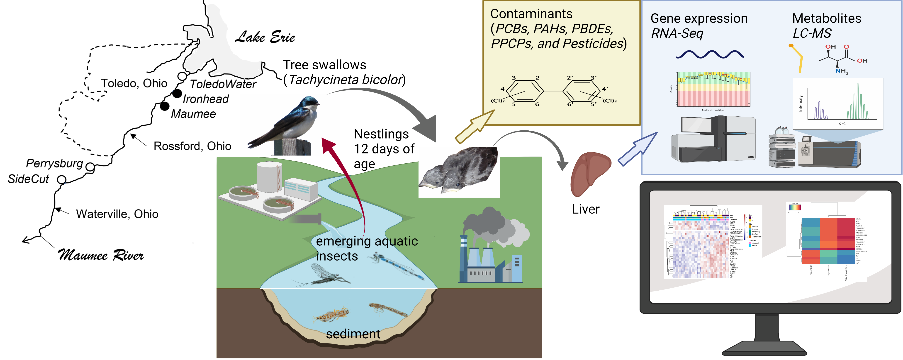
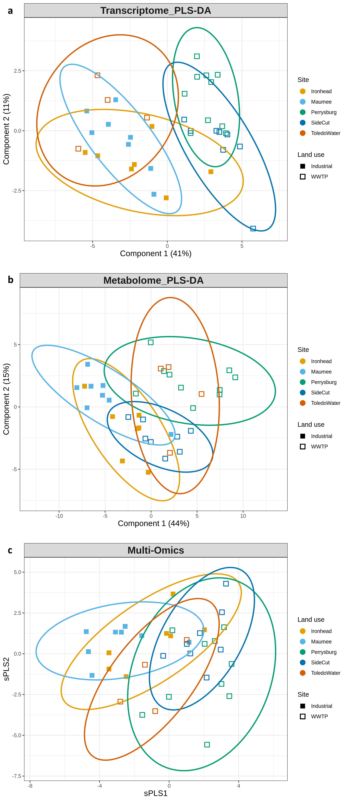
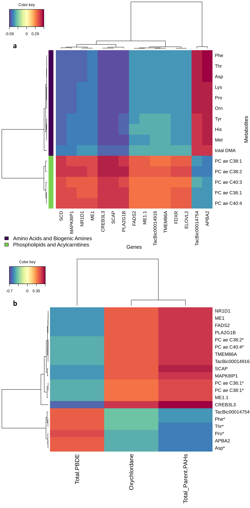

**Chi Yen Tseng^1^**, Christine M. Custer^2^, Thomas W. Custer^2^, Paul M. Dummer^2^, Natalie Karouna‐Renier^3^ and Cole W. Matson^1^

1. Department of Environmental Science, The Institute of Ecological, Earth, and Environmental Sciences (TIE3S), and the Center for Reservoir and Aquatic Systems Research (CRASR), Baylor University, Waco, Texas 76798, United States 
2. Upper Midwest Environmental Sciences Center, U.S. Geological Survey, La Crosse, Wisconsin 54603, United States 
3. U.S. Geological Survey, Eastern Ecological Science Center (EESC) at Patuxent, Beltsville, Maryland 20705, United States

Any use of trade, product, or firm names is for descriptive purposes only and does not imply endorsement by the U.S. Government.

</br>

```{r, include=FALSE}
setwd("~/Documents/work/Maumee_figures/Maumee_MS/docs/")
```


</br>

DOI:http://dx.doi.org/10.1016/j.scitotenv.2022.159130  
[FULL TEXT](Tseng et al. - 2023 - Multi-omics responses in tree swallow (Tachycineta.pdf))  

A multi-omics approach was utilized to identify altered biological responses and functions, and to prioritize contaminants to assess the risks of chemical mixtures in the Maumee Area of Concern (AOC), Maumee River, OH, USA. Tree swallow (Tachycineta bicolor) nestlings were collected at five sites along the Maumee River, which included wastewater treatment plants (WWTPs) and industrial land-use sites. Polychlorinated biphenyls (PCBs), polybrominated diphenyl ethers (PBDEs), polycyclic aromatic hydrocarbons (PAHs), polychlorinated dibenzo p dioxins and furans (PCDD/Fs), and chlorinated pesticide concentrations were elevated in Maumee tree swallows, relative to a remote reference site, Star Lake, WI, USA. Liver tissue was utilized for non-targeted transcriptome and targeted metabolome evaluation. 

#### Results highlight

```{r remediation and site mixture prediction, fig.show="hold", out.width="50%", fig.height=8, echo=FALSE}




```
A significantly differentially expressed gene cluster related to a downregulation in cell growth and cell cycle regulation was identified when comparing all Maumee River sites with the reference site. There was an upregulation of lipogenesis genes, such as PPAR signaling (HMGCS2, SLC22A5), biosynthesis of unsaturated fatty acids (FASN, SCD, ELOVL2, and FADS2), and higher lipogenesis related metabolites, such as docosapentaenoic acid (DPA), docosahexaenoic acid (DHA), eicosapentaenoic acid (EPA), and arachidonic acid (AA) at two industrial land-use sites, Ironhead and Maumee, relative to WWTP sites (Perrysburg and SideCut), and the reference site. Toledo Water, in the vicinity of the other two industrial sites and also adjacent to a WWTP, showed a mix of signals between industrial land-use and WWTP land-use. PAHs, oxychlordane, and PBDEs were determined to be the most likely causes of the differentiation in biological responses, including de novo lipogen esis and biosynthesis of unsaturated fatty acids.

Details about Tree Swallow geomoe assembly, annotation, RNA-Seq data processing can be found in [Supplementary document 1](Supplementary Document 1 Draft12.html)
